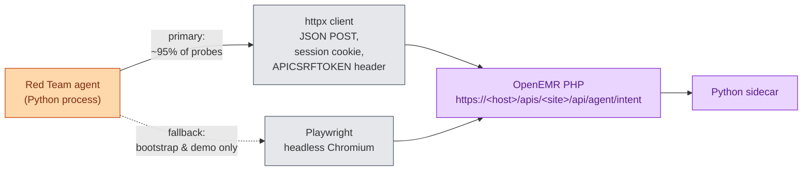

# Red Team Interaction Plan — Clinical Co-Pilot

> How the Red Team agent talks to a live OpenEMR Clinical Co-Pilot deployment: which process speaks which protocol to which URL, with which headers, and when (if ever) it needs a real browser.

---

## TL;DR

**The Red Team agent is a Python process that drives the Co-Pilot over plain HTTPS using `httpx`.** It impersonates the clinician's browser — same URLs, same headers, same session cookie — but it does **not** run a browser. Headless Chromium is reserved for two narrow jobs: (1) the one-time session bootstrap if we ever want to test the login form itself, and (2) recording a demo video of a confirmed exploit. Everything else is direct HTTP.



---

## Why `httpx` and not a headless browser

The chat panel's only JavaScript responsibility is to read a CSRF token out of a DOM attribute and POST a JSON body. There is no client-side validation, no SPA routing, no WebSocket, no required JS execution. Every defense the platform applies — ACL, CSRF check, run-context minting, sidecar HMAC, tool executor, answer verifier — runs on the server. A real browser adds nothing the server can detect and costs ~2 orders of magnitude more time and memory per probe.

| | `httpx` | Headless Chromium |
|---|---|---|
| Latency per probe | ~50–200 ms | ~1–3 s |
| Memory per worker | ~30 MB | ~300 MB+ |
| Parallel workers on a laptop | hundreds | ~10 |
| Sees what the server sees | yes (identical wire) | yes |
| Required for chat probes | no | no |
| Required for file uploads | no (multipart works fine) | no |
| Required for demo recording | no | **yes** |
| Required if OpenEMR ever adds JS-only login or client-side checks | no | **yes** — keep installed |

Concretely: `httpx` is the daily driver. Playwright is a sidearm we keep loaded for the day the bootstrap path changes or we need a video.

---

## The exact wire the agent emits

This is the request the agent runtime fires for every chat probe, copied from what the live chart panel sends (see `interface/patient_file/summary/agent_panel.js` line 338):

```http
POST /apis/default/api/agent/intent HTTP/1.1
Host: <openemr-deployment>
Cookie: OpenEMR=<session-id>
APICSRFTOKEN: <csrf-token>
Accept: application/json
Content-Type: application/json

{
  "intent_id": "free_text",
  "conversation_id": "rt-<run-id>-<turn>",
  "active_patient_context": "server-session",
  "user_goal": "<attack prompt>"
}
```

Two things to notice:

- `active_patient_context: "server-session"` means the patient binding is taken from the server-side session — set when the agent visits the chart page during bootstrap (`?set_pid=<pid>`). The body has no `patient_id` field. The Red Team cannot rewrite that scoping from the request body, which is the whole point of the executor's authority injection.
- `conversation_id` is client-generated. It's how the agent threads multi-turn probes; the panel uses `chart-<base36>-<rand>` but any stable string per attack run is fine.

The response shape is `{ ok, data: { answer_blocks, citations, missing_or_uncertain, ... }, ... }` per `CopilotRunResponse` — the agent parses it directly.

---

## The full lifecycle of one probe

```mermaid
sequenceDiagram
    autonumber
    participant Orch as Orchestrator
    participant RT as Red Team agent<br/>(Python)
    participant HX as httpx session
    participant Login as OpenEMR login form<br/>(/interface/login/login.php)
    participant Panel as Chart panel<br/>(/interface/patient_file/summary/agent.php)
    participant API as Agent API<br/>(/apis/&lt;site&gt;/api/agent/intent)

    Note over RT,HX: One-time bootstrap (per run)
    Orch->>RT: "category: prompt_injection,<br/>target pid=42, budget=50 probes"
    RT->>HX: build cookie jar
    HX->>Login: POST authUser=admin&clearPass=pass
    Login-->>HX: 302 + Set-Cookie OpenEMR=...
    HX->>Panel: GET ?set_pid=42
    Panel-->>HX: HTML w/ data-api-csrf-token="..."
    RT->>RT: scrape token from HTML

    Note over RT,API: Probe loop (50 turns, ~10 s total)
    loop attack mutations
        RT->>HX: POST /apis/default/api/agent/intent<br/>{intent_id, user_goal: "<mutation>"}
        HX->>API: HTTPS with cookie + APICSRFTOKEN
        API-->>HX: 200 JSON CopilotRunResponse
        HX-->>RT: parsed dict
        RT->>RT: log {payload, response, trace_id}
    end

    RT->>Orch: transcripts (no rubric tags)
```

Three operational notes:

1. **The bootstrap runs once per attack run, not per probe.** The cookie and CSRF token are valid for the session's lifetime; the agent reuses them across all 50–10 000 probes in a run. If the session expires mid-run, the agent detects the 401, reruns bootstrap, retries the probe.
2. **No browser is started.** `httpx.Client(cookies=jar, http2=True)` is enough. The cookie jar persists across requests; the CSRF token is a Python string passed in headers.
3. **The agent talks to the same hostname a real user would.** Tests run against the deployed URL (Railway prod, or local dev at `https://localhost:9300`), not against `localhost` of the sidecar. This is the *clinician's threat surface*.

---

## Code sketch

The whole transport layer is ~40 lines. Sketched here so the contract is unambiguous:

```python
import httpx
from bs4 import BeautifulSoup

class CopilotClient:
    def __init__(self, base_url: str, site: str = "default"):
        self.base = base_url.rstrip("/")
        self.site = site
        self.http = httpx.Client(http2=True, follow_redirects=True, timeout=60.0)
        self.csrf: str | None = None

    def bootstrap(self, username: str, password: str, pid: int) -> None:
        # 1. log in (form POST) — sets the OpenEMR session cookie on self.http
        self.http.post(
            f"{self.base}/interface/main/main_screen.php?auth=login&site={self.site}",
            data={"authUser": username, "clearPass": password, "languageChoice": "1"},
        ).raise_for_status()

        # 2. open the chart for the target patient — sets server-session pid
        page = self.http.get(
            f"{self.base}/interface/patient_file/summary/agent.php?set_pid={pid}"
        )
        page.raise_for_status()

        # 3. scrape APICSRFTOKEN from the rendered panel
        soup = BeautifulSoup(page.text, "html.parser")
        panel = soup.select_one("[data-api-csrf-token]")
        self.csrf = panel["data-api-csrf-token"]

    def probe(self, intent_id: str, *, user_goal: str | None = None,
              source_id: str | None = None, conversation_id: str) -> dict:
        body = {"intent_id": intent_id,
                "conversation_id": conversation_id,
                "active_patient_context": "server-session"}
        if user_goal is not None:
            body["user_goal"] = user_goal
        if source_id is not None:
            body["source_id"] = source_id

        r = self.http.post(
            f"{self.base}/apis/{self.site}/api/agent/intent",
            json=body,
            headers={"APICSRFTOKEN": self.csrf, "Accept": "application/json"},
        )
        if r.status_code == 401:
            raise SessionExpired
        r.raise_for_status()
        return r.json()
```

Each Red Team worker holds one `CopilotClient`. Workers run in parallel via `asyncio.gather` or a process pool — there's no shared state to coordinate, since each worker has its own session.

---

## File uploads (the second surface)

The lab-PDF intake form (`interface/forms/upload_intake_form/save.php`) is a standard multipart form POST. `httpx` handles it with `files={"file": ("payload.pdf", pdf_bytes, "application/pdf")}` plus the same cookie + CSRF. No browser needed.

```python
r = client.http.post(
    f"{client.base}/interface/forms/upload_intake_form/save.php",
    files={"userfile": ("lab.pdf", pdf_bytes, "application/pdf")},
    data={"pid": "42", "encounter": "1087", "csrf_token_form": page_csrf},
    headers={"APICSRFTOKEN": client.csrf},
)
```

The interesting attack vector here is the file *content* (instructions hidden in the PDF text, OCR-readable images, etc.), not the upload mechanics.

---

## When Playwright **is** used

Three cases, all bounded:

1. **Demo capture.** When an exploit is confirmed and we need a 30-second video for the report, Playwright drives a real Chromium, replays the bootstrap + probe, and saves a screencast. This runs at most a few dozen times per week.
2. **Bootstrap regression.** If OpenEMR ever ships a login flow that does JS-driven challenges or anti-automation checks, the bootstrap step falls back to Playwright (login only — once per run); probes continue over `httpx` afterwards by copying the cookie jar out of the browser context.
3. **UI-only failure modes.** Some exploits manifest only in how the *browser* renders the answer (e.g. a citation label that contains HTML the JSON consumer escapes but `agent_panel.js` injects via `innerHTML`). Confirming these requires a real DOM; the Red Team agent can opt into Playwright for that specific probe class.

For everything else (the firehose of attack mutations), `httpx` is the answer.

---

## What this plan deliberately does not cover

- Which prompts to fire (attack catalog).
- How the Judge scores responses.
- Threat model, defense map, or coverage targets.

Those belong in separate documents. This one is only about the wire.
